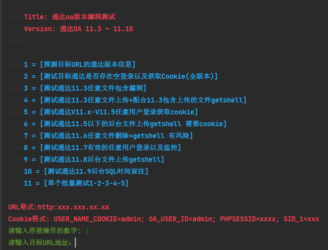
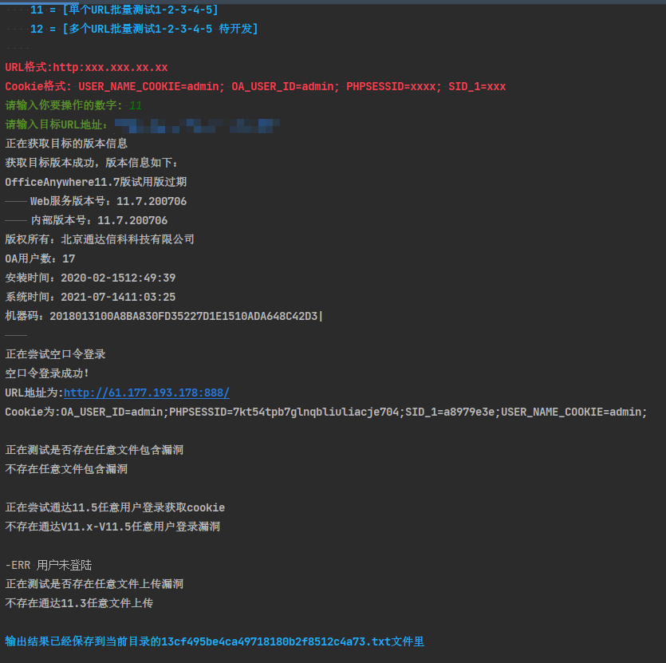
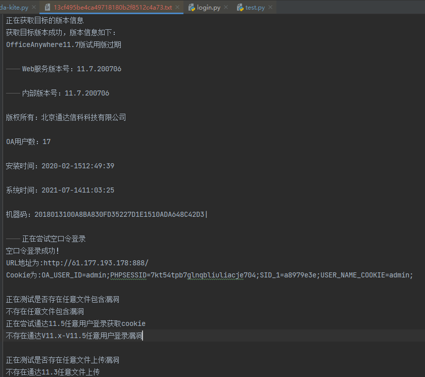

# tongda-kite

通达综合利用脚本项目地址：[tongda-kite](https://github.com/kitezzzGrim/tongda-exp)

`通达常见的exp`

`个人编写的exp,仅供学习和研究使用,请勿使用文中的技术源码用于非法用途,任何人造成的任何负面影响,与本人无关`


用法：

```py
python tongda-kite.py
```

```
1 = [探测目标URL的通达版本信息]
2 = [测试目标通达是否存在空登录以及获取Cookie(全版本)]
3 = [测试通达11.3任意文件包含漏洞]
4 = [测试通达11.3任意文件上传+配合11.3包含上传的文件getshell]
5 = [测试通达V11.x-V11.5任意用户登录获取cookie]
6 = [测试通达11.5以下的后台文件上传getshell 需要cookie]
7 = [测试通达11.6任意文件删除+getshell 有风险]
8 = [测试通达11.7有效的任意用户登录以及监控]
9 = [测试通达11.8后台文件上传getshell]
10 = [测试通达11.9后台SQL时间盲注]
11 = [单个批量测试1-2-3-4-5并输出至文本]
12 = [多个URL批量测试1-2-3-4-5 待开发]
```








---

> create by ffffffff0x